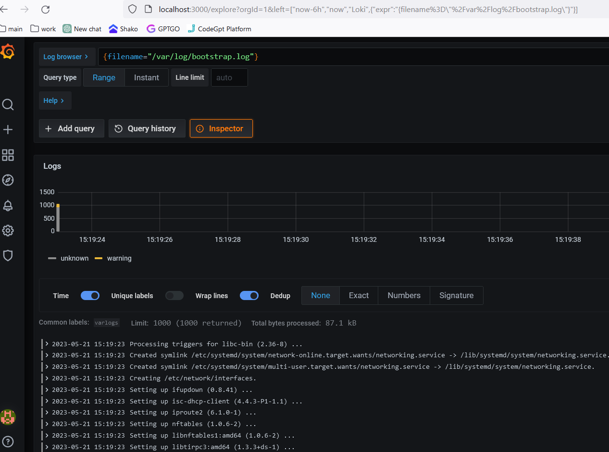
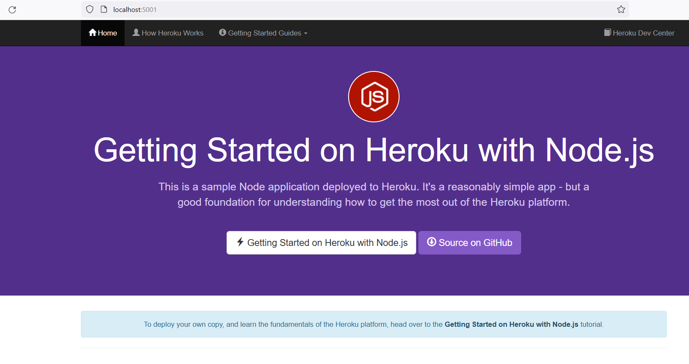

# node-js-getting-started

A barebones Node.js app using [Express 4](http://expressjs.com/).

This application supports the [Getting Started on Heroku with Node.js](https://devcenter.heroku.com/articles/getting-started-with-nodejs) article - check it out.

## Running Locally

Make sure you have [Node.js](http://nodejs.org/) and the [Heroku CLI](https://cli.heroku.com/) installed.

```sh
$ git clone https://github.com/heroku/node-js-getting-started.git # or clone your own fork
$ cd node-js-getting-started
$ npm install
$ npm start
```

Your app should now be running on [localhost:5000](http://localhost:5000/).

## Deploying to Heroku

Using resources for this example app counts towards your usage. [Delete your app](https://devcenter.heroku.com/articles/heroku-cli-commands#heroku-apps-destroy) and [database](https://devcenter.heroku.com/articles/heroku-postgresql#removing-the-add-on) as soon as you are done experimenting to control costs.

By default, apps use Eco dynos if you are subscribed to Eco. Otherwise, it defaults to Basic dynos. The Eco dynos plan is shared across all Eco dynos in your account and is recommended if you plan on deploying many small apps to Heroku. Learn more about our low-cost plans [here](https://blog.heroku.com/new-low-cost-plans).

Eligible students can apply for platform credits through our new [Heroku for GitHub Students program](https://blog.heroku.com/github-student-developer-program).

```
$ heroku create
$ git push heroku main
$ heroku open
```

# Node.js Dockerfile

This repository contains a Dockerfile for a Node.js application. The Dockerfile is based on the official Node.js 18.x image from Docker Hub.
Overview

The Dockerfile performs the following steps:

   1. Sets the base image as `Node.js 18.x`.
   2. Creates a working directory for the application.
   3. Copies the `package.json` file into the container.
   4. Installs necessary dependencies via npm install.
   5. Copies the rest of the application code into the container.
   6. Sets the command to start the application as npm start.
   7. Exposes the application on port `5001`.

## Build the image

To build the Docker image, run the following command in the same directory as the Dockerfile:

```bash
docker build -t <tag-name> .
```

Replace <tag-name> with a name for your image.
Run the container

Once the image has been built, you can run a container with the following command:

```bash

docker run -p 5001:5001 <tag-name>
```

This command will start a new container and expose the application on port 5001 of your host machine.
Notes

This Dockerfile uses the Alpine version of Node.js 18.x, which is smaller than the standard version. This helps to keep the size of the Docker image to a minimum.

# Loki, Promtail, Grafana, and Node.js Docker Compose Setup

This project is a Docker Compose setup for Loki, Promtail, Grafana, and a Node.js application that logs using Loki.

## Version

This project uses `version 3` of the Docker Compose file format (`version: '3'`).

## Networks

The project uses a single network: `docker-lab`.

## Services

The project is composed of the following services:

### Loki

This is a service that runs the Grafana Loki log aggregator and is configured to use the local config file `./loki/local-config.yaml`. It is exposed on port `3100` and its data is stored in a named volume `loki-data`.

### Promtail

This is a service that runs the Grafana Promtail log collector and is configured to use the local config file `./promtail/config.yaml`. It is mounted with the host directories `/var/lib/docker/containers` and `/var/log` so that it can collect logs from the Docker containers and the host machine. It is not exposed on any ports.

### Grafana

This is a service that runs Grafana 7.5.5 and is accessible on port `3000`. It is configured to use the local directory `./grafana/provisioning` for provisioning files and is mounted with the named volume `grafana-data` for persisting data. It is also configured with the environment variable `GF_SECURITY_ADMIN_PASSWORD` set to `admin`.

### Node.js

This is a service that builds a Node.js application and runs it on port `5001`. It depends on the `loki` service to be running and is configured with the environment variable `LOGGING_BACKEND_URL` set to `http://loki:3100/loki/api/v1/push` so that it logs using Loki.

## Volumes

The project uses the following named volumes:

- `loki-config`
- `loki-data`
- `grafana-data`

### Logs form loki datasource in grafana dashboard 



### Nodejs application



# Script that prints numbers from 0 to 100 and convert every 10th digit to a wordy version
```bash
for i in range(101):
    if i % 10 == 0 and i != 0:
        print(str(i) + " - " + ["Ten","Twenty","Thirty","Forty","Fifty","Sixty","Seventy","Eighty","Ninety","Hundred"][int(i/10)-1])
    else:
        print(i)
```

This is a simple Python script that uses a for loop to iterate through the range of numbers from 0 to 100. For each number, it checks if it is divisible by 10, and if so, it prints the wordy version of the number (e.g. "Ten" for 10, "Twenty" for 20, etc.) by accessing the appropriate index in the list. If the number is not divisible by 10, it simply prints the number.